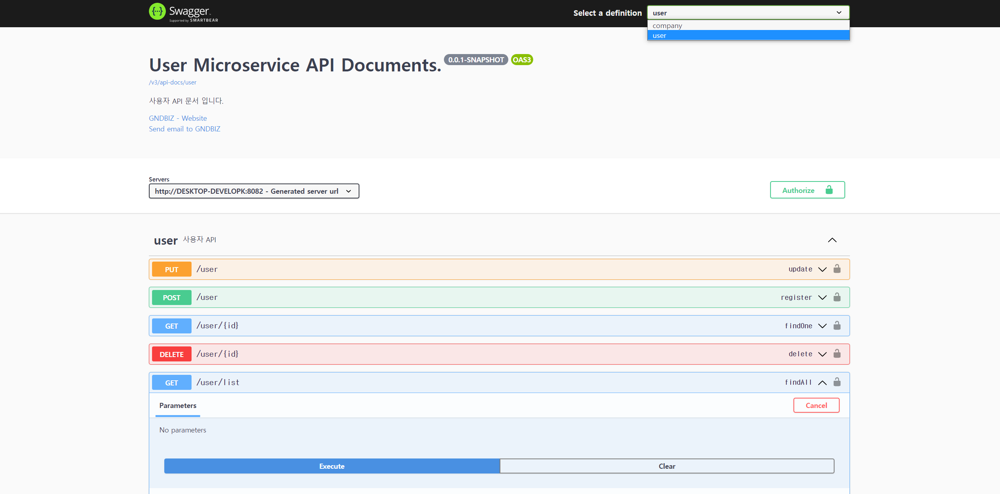

# 업데이트내역

## 2021-08-30

- api-doc path 수정

client 측에서 요청 시 http://{gateway-host}:{gateway-port}/api/{microservice-path}/{path} 형식으로 변경.

- 각 microservice에서는 swagger-ui 진입이 되지 않도록 변경
  http://{gateway-host}:{gateway-port}/swagger-ui.html 로만 swagger-ui 제공 되도록 변경

- prod 프로필(운영) 에서는 openapi 적용 제외 설정 추가

## 2021-08-24
- springdoc-openapi가 적용되었습니다. local 프로파일로 실행 기준 http:/localhost:9002/swagger-ui.html을 확인하세요.

Authorization 버튼클 클릭하면 로그인 계정 및 Oauth Client 정보를 입력하여 인증토큰을 가져온 후 API를 테스트 할 수 있습니다.

- MapStruct 라이브러리를 적용하여, Entity <-> Form, DTO 변환 작업을 간단히 적용할 수 있도록 하였습니다.
해당 라이브러리의 자세한 설명은 링크로 대체합니다. https://huisam.tistory.com/entry/mapStruct
